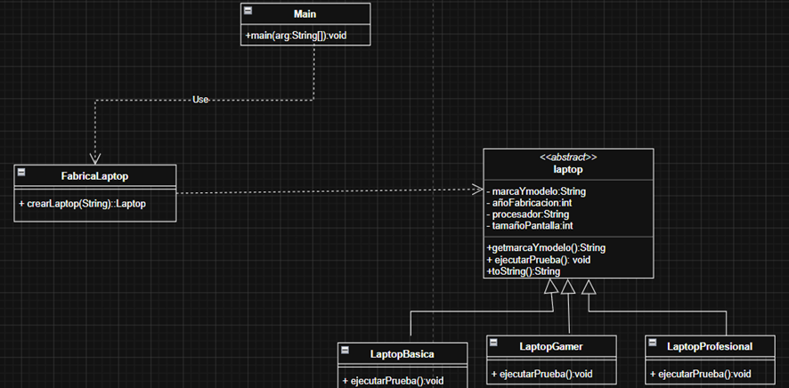

# Semana 12 - Patrón Simple Factory

## Descripción del problema

Se requiere crear tres tipos de laptops: **Básica**, **Gamer** y **Profesional**.
Cada laptop tiene características propias como marca y modelo, año de fabricación,
procesador y tamaño de pantalla. Además debe indicar qué tipo de laptop se está
ejecutando mediante un método de prueba.

## Patrón implementado

Se utilizó el patrón **Simple Factory (Factoría Simple)**, el cual centraliza
la creación de objetos en una sola clase fábrica

## Diagrama de clases

Markdown